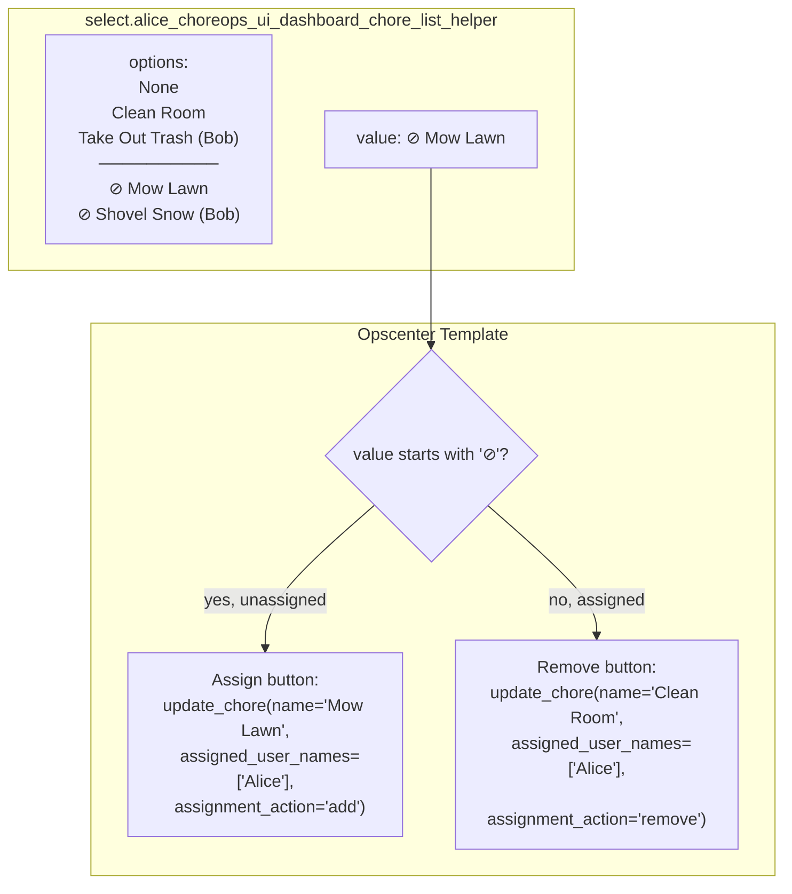

# Initiative Plan: Admin Dashboard Chore Assignment Management

## Initiative snapshot

- **Name / Code**: `admin-chore-assignment-management`
- **Target release / milestone**: v0.7.0
- **Owner / driver(s)**: TBD
- **Status**: _Complete — all phases delivered_

## Summary & immediate steps

| Phase | Description | % complete | Quick notes |
|---|---|---|---|
| Phase 1 — Core Backend | Select options extension + `assignment_action` + select sync | **100%** | 7 files changed, 128 tests pass |
| Phase 2 — Dashboard Template | Opscenter assignment management card | **100%** | Both admin templates updated |
| Phase 3 — Testing & Polish | Dedicated tests for new functionality | **100%** | 4 `assignment_action` tests, 128 total pass |

1. **Key objective**: Give admins a per-user chore assignment interface in the opscenter. Extend the existing `AssigneeDashboardHelperChoresSelect` to show both assigned and unassigned chores. Add `assignment_action: add|remove|replace` to `update_chore` so the backend handles list merging rather than the frontend. Automatically sync select display names after assignment changes so the UI never shows stale values.

2. **Summary of completed work**:
   - **Phase 1 complete**: All backend changes implemented, debugged, and validated.
   - Select `options` now show assigned chores first (with co-assignee names in parentheses), a visual divider, then unassigned chores prefixed with `⊘` (circled division slash).
   - `build_chore_select_display_name()` shared helper in `entity_helpers.py` — used by both `select.py` and the service-level sync function for consistent display names.
   - `assignment_action` field added to `update_chore` with `add`/`remove`/`replace` (default = `replace`, backward compatible).
   - Merge logic in service handler: `add` deduplicates with `dict.fromkeys`, `remove` filters out target IDs.
   - `_sync_chore_select_selection()` runs **before** entity sync so HA never sees a stale select state. Iterates all assignees to catch co-assignee display changes. Handles `"unknown"` recovery for both previously and newly assigned users.
   - Lint + MyPy clean, 124 existing tests pass, live-tested with multi-user add/remove scenarios.

3. **Next steps**: Begin Phase 2 implementation. The admin-peruser-v1 template's Chore Management section already has a `chore_select_entity` (the `select.{user}_choreops_ui_dashboard_chore_list_helper`) that now shows all chores with `⊘` prefix for unassigned ones. We need to add conditional Assign/Remove buttons that detect the prefix and call `choreops.update_chore` with the appropriate `assignment_action`.

4. **Challenges resolved during implementation**:
   - **Select going "unknown"**: HA resets a select entity when `current_option` is not in `options`. Fixed by (a) syncing selects before entity sync so HA never sees the mismatch, (b) iterating ALL assignees (not just previous/new union) because any user can have an unassigned chore selected, (c) allowing "unknown" recovery for both `previous_assigned` and `new_assigned` users.
   - **Co-assignee display changes**: When user B is added to a chore, user C's display changes from `"⊘ Chore (A)"` to `"⊘ Chore (A, B)"`. The union approach missed user C. Fixed by always iterating all assignees.
   - **5-10s delay**: `async_block_till_done()` waited for fire-and-forget shard finalization tasks. Fixed by moving sync before entity sync — coordinator data is already live after `update_chore()`.

5. **Risks / blockers**:
   - Select options size: adding unassigned chores doubles the option count. Mitigation: unassigned chores are typically <5% of total chores.
   - Template strips `⊘ ` prefix from selected value using Jinja2's `removeprefix` before passing to service (requires Jinja2 ≥3.1 / HA 2024.1+).

5. **References**:
   - [ARCHITECTURE.md](../ARCHITECTURE.md) — Data model, FSM contract
   - [DEVELOPMENT_STANDARDS.md](../DEVELOPMENT_STANDARDS.md) — Coding standards, constant naming
   - [CHORE_AVAILABILITY_UNIFIED_PLAN_IN-PROCESS.md](./CHORE_AVAILABILITY_UNIFIED_PLAN_IN-PROCESS.md) — Prerequisite feature (empty assignee list + `*` wildcard)
   - `select.py:475` — `AssigneeDashboardHelperChoresSelect` class (target for options extension)
   - `services.py` — `handle_update_chore` (target for `assignment_action`)
   - `chore_manager.py` — `update_chore()` method (target for merge logic)

6. **Decisions & completion check**
   - **Decisions captured**:
    - Select entity extended (not new entity) — unassigned chores shown with `⊘ ` prefix
    - `⊘ ` prefix is visual only — template strips it via `removeprefix`, service resolves name→ID internally via `get_item_id_or_raise`
     - `assignment_action: replace` is default = backward compatible
     - No new entity attributes, no new entity types
     - Backend merge logic lives in `chore_manager.update_chore()`
   - **Completion confirmation**: `[ ]` All phases complete, tests pass, opscenter template updated.

---

## Architecture



## Detailed phase tracking

### Phase 1 — Core Backend

- **Goal**: Extend select options to include unassigned chores. Add `assignment_action` to `update_chore` service for backend-managed list merging.

**Steps / detailed work items**:

1. [x] `const.py` — `UNASSIGNED_CHORE_PREFIX = "⊘ "`, `SELECT_SECTION_DIVIDER`, `SERVICE_FIELD_CHORE_CRUD_ASSIGNMENT_ACTION`, `ASSIGNMENT_ACTION_*`
2. [x] `select.py` — `AssigneeDashboardHelperChoresSelect.options` extended with unassigned section + co-assignee display
3. [x] `services.py` — `UPDATE_CHORE_SCHEMA` extended with `assignment_action`; merge logic in `handle_update_chore`
4. [x] `services.yaml` — `assignment_action` documented with add/remove/replace options
5. [x] `translations/en.json` — `assignment_action` field name and description

**Key issues / Divergences from plan**:
- **Divergence: `⊘` instead of `➕` for unassigned prefix**: User requested a neutral "not assigned" indicator rather than one suggesting an "add" action. `⊘` (circled division slash) was chosen.
- **Divergence: co-assignee display**: Chore entries now show other assignees in parentheses (e.g., `"Clean Room (Bob)"`) so admins can see who else is assigned without leaving the select. Applies to both assigned and unassigned entries.
- **Divergence: visual divider instead of text**: Used `──────────` (Unicode box-drawing) rather than a translatable text label to avoid translation injection challenges in select entities.
- **Divergence: merge in service handler, not chore_manager**: Per DEVELOPMENT_STANDARDS.md §5.2, the service handler owns the merge logic. The manager method `update_chore()` receives the already-merged list.
- **Addition: `build_chore_select_display_name()` shared helper**: Extracted to `entity_helpers.py` to ensure `select.py` options and `services.py` sync function produce identical display names. Eliminates duplicate inline logic.
- **Addition: `_sync_chore_select_selection()`**: Runs before entity sync to prevent HA from resetting selects to `"unknown"`. Iterates all assignees (not just previous/new union) to catch co-assignee display changes. Recovers `"unknown"` state for both previously and newly assigned users.
- **Addition: sync-before-entity order**: Sync runs before `async_sync_chore_entities` because coordinator data is already live after `update_chore()`. Eliminates the 5-10s `async_block_till_done()` delay waiting for shard finalization tasks.

---

### Phase 2 — Dashboard Template

- **Goal**: Add assign/remove buttons to the Chore Management section of `admin-peruser-v1.yaml`. When an admin selects a chore from the per-user dropdown, a conditional button card appears below the management summary offering "Assign to [User]" or "Remove from [User]" based on whether the selected option starts with the `⊘ ` prefix.

**UX analysis**: The `admin-peruser-v1` template already has a Chore Management section with:

1. A collapsible header card (`management_summary_card`) showing the chore selector + selected chore name
2. Below it, when expanded, chore details and action cards

The select entity (`select.{user}_choreops_ui_dashboard_chore_list_helper`) now returns options like:
- `"Clean Room (Bob)"` — assigned to this user, with co-assignee context
- `"Clean Room"` — assigned to this user, sole assignee
- `"──────────"` — visual divider
- `"⊘ Mow Lawn (Alice)"` — unassigned, with current assignee context
- `"⊘ Shovel Snow"` — unassigned, no assignees

**Design**: A single conditional button card inserted after the management summary card, visible only when `has_selected_chore` is true:

| Condition | Button | Service call |
|---|---|---|
| `selected_chore_name` starts with `⊘ ` | **Assign to [User]** | `update_chore` with `assignment_action: add`, `assigned_user_names: [user]` |
| Otherwise (assigned) | **Remove from [User]** | `update_chore` with `assignment_action: remove`, `assigned_user_names: [user]` |

**Chore name extraction**: Strip `⊘ ` prefix and ` (co-assignee)` suffix before passing to service:
```jinja2


```

**Steps / detailed work items**:

1. [ ] `admin-peruser-v1.yaml` — Add assignment button card after `management_summary_card`:
    - Visible only when `has_selected_chore` is true
    - `⊘` prefix detection: ``
    - Assign button: `mdi:account-plus-outline` icon, `var(--success-color)` tint, calls `update_chore` with `assignment_action: add`
    - Remove button: `mdi:account-minus-outline` icon, `var(--error-color)` tint, calls `update_chore` with `assignment_action: remove`
    - Both extract the core chore name via `.removeprefix()` + `.split(' (')[0]`

2. [ ] `admin-shared-v1.yaml` — Mirror the same assignment card (if it has a per-user chore selector)

3. [ ] After service call behavior: the `_sync_chore_select_selection` function runs synchronously before entity sync and updates the select's display name. The select rebuilds its options on the next coordinator refresh. No manual reset needed — the sync handles it.

4. [ ] `utils/sync_dashboard_assets.py` — Run after template edits to sync into `custom_components/choreops/dashboards/`

**Key design decisions**:
- **Single button card, not two**: One card that conditionally renders either the assign or remove variant. Simpler template, less conditional nesting.
- **No select reset**: The sync function handles display name updates. The select stays on the selected chore; its display updates from `⊘ Chore` to `Chore` (or vice versa).
- **Strip co-assignee suffix**: `"⊘ Mow Lawn (Alice)"` → extract `"Mow Lawn"` for the service call. Co-assignee info is visual only.
- **Follow DASHBOARD_UI_DESIGN_GUIDELINE.md**: Use theme variables for colors, `card-background-color` for surface, `divider-color` for borders, semantic icon choices.

---

### Phase 3 — Testing & Polish

- **Goal**: Verify all paths, no regressions, size stays within limits.

**Steps / detailed work items**:

1. [ ] `tests/test_select.py` — New tests for `AssigneeDashboardHelperChoresSelect`:
    - Options include assigned chores without prefix
    - Options include unassigned chores with `⊘ ` prefix
    - `--- Unassigned ---` header present when unassigned chores exist
    - No unassigned section when no unassigned chores exist
    - `None` sentinel always first

2. [ ] `tests/test_chore_crud_services.py` — New tests for `assignment_action`:
    - `add`: chore with ["Alice"] + add ["Bob"] → ["Alice", "Bob"]
    - `add` with duplicate: chore with ["Alice"] + add ["Alice"] → ["Alice"]
    - `add` with `*`: chore with ["Alice"] + add `*` → all assignable users
    - `remove`: chore with ["Alice", "Bob"] + remove ["Bob"] → ["Alice"]
    - `remove` with `*`: chore with ["Alice", "Bob"] + remove `*` → []
    - `replace` (default): chore with ["Alice"] + replace ["Bob"] → ["Bob"] (backward compat)
    - Missing `assignment_action` → defaults to `replace`

3. [ ] `tests/test_chore_manager.py` — Verify `update_chore()` rotation cleanup still works when list becomes empty via `assignment_action: remove`.

4. [ ] Size validation: measure select attributes JSON size at 100 assigned + 20 unassigned chores. Should stay well under 12KB (options are compact strings).

**Post-implementation validation**:
```bash
./utils/quick_lint.sh --fix
mypy custom_components/choreops/
python -m pytest tests/ -v --tb=line
```

---

## Affected Files

| File | Change | Description |
|---|---|---|
| `select.py` | Modify | `AssigneeDashboardHelperChoresSelect.options` — include unassigned chores with `⊘ ` prefix + co-assignee display |
| `const.py` | Add | `SERVICE_FIELD_CHORE_CRUD_ASSIGNMENT_ACTION`, `ASSIGNMENT_ACTION_*` enum values |
| `services.py` | Modify | `UPDATE_CHORE_SCHEMA` — add `assignment_action` field; merge logic; `_sync_chore_select_selection()` |
| `helpers/entity_helpers.py` | Modify | `build_chore_select_display_name()` — shared helper for display name consistency |
| `services.yaml` | Modify | Document `assignment_action` field |
| `translations/en.json` | Modify | Field name + description |
| `choreops-dashboards/templates/` | Modify | Opscenter assignment management card |
| `tests/test_select.py` | Add | Select options tests |
| `tests/test_chore_crud_services.py` | Add | `assignment_action` tests |

**NOT changing**: `sensor.py` (no new entity data), `managers/` (merge logic in service handler per §5.2, not in manager), `data_builders.py` (empty-assignee validation removed in prerequisite feature).

## Architecture Compliance

| Rule | Compliance |
|---|---|
| No hardcoded strings | ✅ `ASSIGNMENT_ACTION_*` constants, `⊘ ` prefix as `const.UNASSIGNED_CHORE_PREFIX` |
| No new entity types | ✅ Extends existing select |
| No new entity attributes | ✅ Only `options` list changes |
| Backward compatible | ✅ `assignment_action` defaults to `replace` |
| Persist → Emit order | ✅ Service handler → chore_manager.update_chore → persist → emit |
| Lazy logging | ✅ `%s` format |
| Type hints 100% | ✅ |
| Docstrings required | ✅ |
| DRY display names | ✅ `build_chore_select_display_name()` shared between `select.py` and `services.py` |
| Event-driven sync | ✅ Sync runs synchronously before entity sync — no polling or delays |

## Notes & Follow-Up

- **Phase 2 (Dashboard Template)**: The opscenter template needs a conditional card that detects the `⊘` prefix on the selected option and renders "Assign" or "Remove" buttons calling `choreops.update_chore` with `assignment_action: add` or `assignment_action: remove`.
- **Phase 3 (Testing)**: Dedicated tests for the new select options (assigned/unassigned sections, co-assignee display) and `assignment_action` merge logic should be added in `tests/test_select.py` and `tests/test_chore_crud_services.py`.
- **Co-assignee display**: The `"Name (Alice, Bob)"` format may get cluttered with many users. The `user_names` list could be truncated with `"..."` suffix or limited to N names. Evaluate during Phase 2 template work.
- **Select sync is event-driven**: `_sync_chore_select_selection()` runs synchronously before entity sync, so select state is corrected before HA ever processes the options change. No manual delay or polling.
